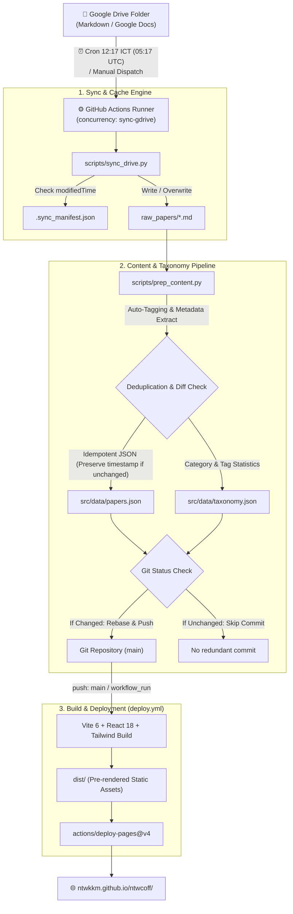

# NTWK Coffee Science — Deep Research Portal ☕️🔬

คลังความรู้และพอร์ทัลวิเคราะห์งานวิจัยวิทยาศาสตร์กาแฟเชิงลึก (**Coffee Science Deep Research**) ซิงค์ข้อมูลอัตโนมัติจาก **Google Drive** ผ่าน **GitHub Actions** ทุกวันเวลา **12:17 น. (เวลาไทย)** พร้อมระบบวิเคราะห์จัดแท็กอัตโนมัติ (Taxonomy Engine) บนผืนกระดาษ Cream Paper อบอุ่น พร้อมการยศาสตร์การอ่านทางวิทยาศาสตร์ระดับสากล

[](https://github.com/NTWKKM/ntwcoff/actions/workflows/deploy.yml)
[](https://github.com/NTWKKM/ntwcoff/actions/workflows/sync.yml)
[](https://ntwkkm.github.io/ntwcoff/)
[](LICENSE)

---

## 🌟 ฟังก์ชันการทำงานหลัก (Core Capabilities)

### 1. ระบบ CI/CD แยกส่วน & ซิงค์คลาวด์อัจฉริยะ (Decoupled, Off-Peak & Idempotent Sync Pipeline)
- **Automated Drive Sync Action (`sync.yml`)**: ซิงค์ข้อมูลงานวิจัยอัตโนมัติจาก Google Drive ทุกวันเวลา **12:17 น. ICT** (Indochina Time, UTC+7 / `05:17 UTC`) โดยปรับเลี่ยงช่วงต้นชั่วโมง (Minute 0) เพื่อขจัดปัญหาคิวสะสมและความล่าช้าของ GitHub Actions Runner
- **Single Concurrency & Resilient Rebase**: ควบคุม Concurrency กลุ่มเดี่ยว (`concurrency: group: sync-gdrive`) ป้องกัน Race Condition ระหว่าง Manual Trigger กับ Scheduled Cron พร้อมผสานคำสั่ง `git pull --rebase origin main` ก่อน Push ป้องกันข้อผิดพลาด Non-fast-forward
- **Content-Aware Idempotency**: ระบบประมวลผล `scripts/prep_content.py` เปรียบเทียบเนื้อหางานวิจัยและโครงสร้าง Taxonomy ก่อนบันทึกทับ หากไม่มีข้อมูลแก้ไขใน Google Drive จะคงค่า `taxonomy.lastUpdated` เดิมไว้ ทำให้ Git ไม่สร้าง Commit ซ้ำซ้อน (`chore: sync papers from Google Drive`) และไม่ทริกเกอร์บิลด์หน้าเว็บโดยไม่จำเป็น
- **Dedicated Web Deploy Action (`deploy.yml`)**: บิลด์และดีพลอย Vite SPA ขึ้นสู่ GitHub Pages ทันทีทุกครั้งที่มีการ `git push` เข้าสู่ branch `main` หรือเมื่อกระบวนการซิงค์ข้อมูลจาก Google Drive มีเนื้อหาใหม่เสร็จสิ้นผ่าน `workflow_run`
- **Smart Manifest Cache (`.sync_manifest.json`)**: ตรวจสอบ `modifiedTime` ของไฟล์บน Google Drive หากไฟล์ไม่มีการแก้ไขจะข้ามการดาวน์โหลดทันที (`[UNCHANGED]`) ช่วยประหยัดเวลาและ Bandwidth
- **Multi-Format Ingestion**: รองรับทั้งไฟล์ Markdown (`.md`), ข้อความธรรมดา (`.txt`), และเอกสาร Google Docs (แปลงเป็น Markdown/Plain Text อัตโนมัติ)

---

### 2. ระบบป้องกันไฟล์และข้อมูลซ้ำ 4 ชั้น (4-Layer Anti-Duplication Engine)
- **Layer 1 (File Storage)**: บันทึกทับไฟล์เดิมในพาธ `raw_papers/<file_name>.md` ทันที ไม่สร้างไฟล์เบิ้ล (เช่น `file (1).md`)
- **Layer 2 (Drive Collision Resolution)**: ตรวจจับกรณีมีหลายไฟล์ใน Google Drive ที่ตั้งชื่อซ้ำกันเป๊ะ (คนละ File ID) โดยระบบจะเติม Short ID (`_{id[:6]}`) กำกับอัตโนมัติเพื่อป้องกันไฟล์ชนกัน
- **Layer 3 (Git Versioning & Idempotent Content Prep)**: ใช้การตรวจสอบ Content Hash และข้อมูลเชิงโครงสร้าง หากไฟล์ที่ดึงมาเนื้อหาไม่เปลี่ยนแปลง Git จะไม่สร้าง Commit ซ้ำ
- **Layer 4 (Data Pipeline Deduplication)**: ตรวจจับหัวข้องานวิจัยซ้ำ (Normalized Title Matching) หากพบไฟล์ที่มีชื่องานวิจัยเดียวกัน ระบบจะควบรวม (Merge) และเก็บเฉพาะฉบับล่าสุดไว้เพียง 1 รายการใน `papers.json`

---

### 3. ระบบจำแนกหมวดหมู่และจัดแท็กอัตโนมัติ (Coffee Science Taxonomy Engine)
ประมวลผลเนื้อหางานวิจัยผ่าน `scripts/prep_content.py` และติดแท็กอัตโนมัติตาม Keyword Ontology ด้านวิทยาศาสตร์กาแฟกว่า 20 หมวด:
- **กลิ่นรสและประสาทสัมผัส**: `#SensoryScience`, `#CoffeeBody`, `#Astringency`, `#Q-Grader`, `#Tribology`
- **เคมีและอุณหพลศาสตร์การคั่ว**: `#RoastingChemistry`, `#MaillardReaction`, `#SucrosePyrolysis`, `#Melanoidins`, `#Acrylamide`, `#5-HMF`, `#Phenolics`
- **การสกัดและฟิสิกส์การชง**: `#Extraction`, `#WaterChemistry`, `#GrindingPhysics`, `#KineticModeling`
- **การแปรรูป ชีววิทยา และความปลอดภัยอาหาร**: `#Fermentation`, `#SpecialtyCoffee`, `#FoodSafety`, `#FT-ICR-MS`

นอกจากนี้ ระบบยังสกัด Metadata สำคัญครบถ้วน:
- ชื่อบทความวิจัยสากล (English Research Title)
- คณะผู้วิจัย (Authors) และสถาบันวิจัย (Institutions)
- วารสารวิชาการที่ตีพิมพ์ (Peer-Reviewed Journals & DOI Links)
- วันที่และลำดับการทดลอง (Date & Chronology)
- คำนวณจำนวนคำ (Word Count) และประเมินเวลาอ่าน (Estimated Reading Time)

---

### 4. ประสบการณ์การอ่านและการยศาสตร์ทางวิทยาศาสตร์ (Editorial Design & Reading Ergonomics)
- **Warm Editorial Paper Canvas**: ออกแบบในสไตล์สมุดบันทึกแล็บวิจัยที่อบอุ่นและจับต้องได้ บนผืนผ้าใบกระดาษสีครีม Cream Paper (`#fdfbf9`), เส้นขอบโครงสร้างสีถ่าน Charcoal (`#171717`) หนา 1.5px, หัวข้อสีหมึกโกโก้ Cocoa Ink (`#2b1a07`), พื้นผิวรอง Dew Drop (`#f7efe9`), ปากกาเน้นข้อความ Marker Orange (`#ff6f1e`), สีส้มอิฐ Burnt Sienna (`#ce500a`), พร้อมสติกเกอร์ตกแต่ง Sky Sticker (`#3b82f6`) และ Bubblegum (`#ff66cf`)
- **Tactile Dot Grid Matrix**: เท็กซ์เจอร์จุดสมุดแล็บ (`.bg-notebook-dots`) ด้วย CSS Radial Gradient บริเวณ Hero และ Catalog ให้สัมผัสกระดาษวิจัยจริง
- **Display Typography & Playful Accents**:
  - ตัวพิมพ์หัวข้อ `gelica` (Fraunces / Plus Jakarta Sans) ตัวพิมพ์เล็ก (lowercase display) ในเฉดสี Cocoa Ink บรรทัดแน่น 1.08x พร้อมระยะคำนวณ `leading-[1.08]`
  - คำทักทายลายมือเขียนจริง (*dear coffee geeks,*) พร้อมลูกศรลายเส้นมือวาด
  - ไฮไลต์ปากกาเน้นข้อความ Marker Highlight (`.marker-highlight`)
  - สติกเกอร์ตกแต่งรูปทรงป้ายชื่อ (*vol. 2026*, *peer-reviewed*)
- **Category Color-Coding**: การ์ดงานวิจัย (`PaperCard`) มีแถบสี 4px ด้านบนและจุดสถานะจำแนกตามสาขาวิชาวิทยาศาสตร์:
  - 🔵 **การสกัด (Extraction)**: สีฟ้า Sky Blue (`#0ea5e9`)
  - 🟠 **กลิ่นรส (Sensory)**: สีส้ม Marker Orange (`#ff6f1e`)
  - 🟤 **การคั่ว (Roasting)**: สีอำพัน Amber (`#d97706`)
  - 🟢 **การหมัก/แปรรูป (Fermentation)**: สีมรกต Emerald (`#059669`)
- **Tactile 12px Cards & 20px Pill Buttons**:
  - Feature Cards ขอบมน **12px (`rounded-[12px]`)** ขอบ Charcoal 1.5px พร้อมเงาโปร่งเบา `shadow-card`
  - ปุ่มควบคุมและฟิลเตอร์ทั้งหมดเป็นทรงแคปซูลมน **20px (`rounded-full`)** ขอบ Charcoal 1.5px พื้นหลังสีครีม ยกตัวด้วยมิติเงาเบา (Paper-lift shadow) ปราศจากสีทึบตัน
  - แถบแบรนด์ท้ายเว็บ (Footer Brand Band) สี Marker Orange โค้งมนด้านบน **56px (`rounded-t-[56px]`)**
- **โครงสร้างบทความวิจัย 4 ส่วนมาตรฐาน (Standard Scientific Editorial Hierarchy)**:
  - จัดระเบียบเนื้อหาบทความเป็น 4 ตอนมาตรฐานวิชาการ: `01 | Research Objectives`, `02 | Methodology`, `03 | Key Scientific Findings`, และ `04 | Practical Applications` พร้อมป้ายเลข Mono-badge
  - ไฮไลต์ข้อค้นพบหลักด้วยป้ายกำกับพิเศษ `💡 ข้อค้นพบหลัก (Key Findings)`
  - กำจัดตาราง Preamble ซ้ำซ้อนและลายเซ็นท้ายรายงาน นำเสนอเนื้อหาวิจัยเข้มข้นทันที
- **Scientific Parameter Chips & Range Detection**: ตรวจจับและแปลงตัวแปรการทดลองทางวิทยาศาสตร์เป็นชิปพารามิเตอร์อัตโนมัติ (`.param-badge`) ครอบคลุมทั้งช่วงตัวเลขและหน่วยวัด:
  - อุณหภูมิ (`4°C`, `92°C`, `90-95°C`)
  - ระยะเวลา (`24 ชั่วโมง`, `6 นาที`, `18-24 ชม.`)
  - แรงดันและของเหลว (`9 bar`, `200 mL`, `30 ml`)
  - มวลและอนุภาค (`15 g`, `400 µm`, `μm`, `ppm`, `ppb`)
  - ความเร็วรอบและค่าสากล (`rpm`, `Agtron`, `kHz`, `%`)
- **การยศาสตร์การอ่านบทความยาว (Reading Ergonomics per `modern-web-guidance`)**:
  - กำหนดความกว้างคอลัมน์อ่านให้อยู่ในระยะสายตาสบายตา 65ch–75ch (`max-w-[70ch]`) ป้องกันอาการล้าของสายตา
  - สารบัญอัจฉริยะ (Dynamic TOC) ตรวจจับหัวข้ออัตโนมัติ พร้อม Scroll-spy ไฮไลต์ตามตำแหน่งที่อ่าน
  - เส้นแสดงความคืบหน้าการอ่าน (Scroll Progress Bar) สี Marker Orange แบบ Native CSS Scroll Timeline
  - แถบเครื่องมือควบคุมการอ่าน (Reader Toolbar): ปรับขนาดตัวอักษรได้ 3 ระดับ (`A-` 15px, `A` 17px, `A+` 19px) และปรับความกว้างคอลัมน์ (`Focus` 65ch / `Standard` 75ch / `Wide`)
  - Light-dismiss Backdrop: ปิดหน้าต่างอ่านได้สะดวกรวดเร็วทั้งการคลิกพื้นที่ว่างรอบนอกหรือกดปุ่ม `Escape`
  - ประสิทธิภาพการแสดงผล: การ์ดแคตาล็อกใต้ Fold ใช้ `content-visibility: auto` และ `contain-intrinsic-size` เพิ่มความลื่นไหลระดับ 60fps
  - รองรับสูตรคณิตศาสตร์และสมการเคมีสมบูรณ์แบบด้วย **KaTeX** (\$C_3H_5NO\$, \$5\text{-HMF}\$, \$HMW > 5\text{ kDa}\$, \$m/z\$)
  - ปุ่ม **Copy Citation**: คัดลอกรายการอ้างอิงรูปแบบมาตรฐานวิชาการได้ในคลิกเดียว
  - รองรับ Deep Linking ผ่าน URL Hash (`#paper=<slug>`) แชร์ลิงก์ตรงสู่งานวิจัยได้ทันที

---

## 🔄 แผนผังการทำงานของระบบ (Data Flow Architecture)



---

## 📂 โครงสร้างไดเรกทอรี (Directory Structure)

```
ntwcoff/
├── .github/
│   └── workflows/
│       ├── sync.yml              # GitHub Actions Cron 12:17 ICT (Google Drive Sync Pipeline & Concurrency)
│       └── deploy.yml            # Build Vite & Deploy Web Application to GitHub Pages
├── scripts/
│   ├── sync_drive.py             # ดึงไฟล์จาก Drive, ตรวจ Manifest Cache, ป้องกันชื่อซ้ำ
│   └── prep_content.py           # สกัด Metadata, จำแนก 20 แท็ก, ลบข้อมูลซ้ำ, ตรวจ Idempotency, สร้าง JSON
├── raw_papers/                   # คลังเอกสารวิจัยต้นฉบับ Markdown ที่ซิงค์มาจาก Google Drive
├── src/
│   ├── components/
│   │   ├── Navbar.tsx            # แถบเมนูบน 56px, แบรนด์สมุดบันทึกวิจัย, สลับธีม, แสดงสถานะ Sync
│   │   ├── HeroBanner.tsx        # ส่วนต้อนรับสไตล์สมุดบันทึก, หัวข้อ Gelica, ปากกาเน้นข้อความ, ช่องค้นหา
│   │   ├── FilterBar.tsx         # Tab Pills สลับหมวดหมู่ และแถบคัดกรอง 20 Scientific Tags บนพื้น Dew Drop
│   │   ├── PaperCard.tsx         # การ์ดงานวิจัย 12px, แถบสี 4px แยกหมวดหมู่, Top-3 Tags, Deferred Render
│   │   ├── PaperReader.tsx       # โมดอลอ่านงานวิจัย, 65ch-75ch Measure, Sticky TOC, แถบ Scroll Progress
│   │   └── KatexRenderer.tsx     # ตัวเรนเดอร์ KaTeX, ลำดับหัวข้อ 01-04, ป้าย Key Findings, ชิปพารามิเตอร์
│   ├── data/
│   │   ├── papers.json           # ฐานข้อมูลงานวิจัยทั้งหมดที่ประมวลผลแล้ว
│   │   └── taxonomy.json         # สถิติหมวดหมู่และแท็กทั้งหมด
│   ├── types.ts                  # โครงสร้าง Type Definitions (TypeScript)
│   ├── App.tsx                   # คอมโพเนนต์หลัก, ระบบค้นหา/กรอง, การ์ดกริด 2 คอลัมน์, Footer Brand Band 56px
│   └── index.css                 # Custom Color Tokens, ฟอนต์ Gelica, KaTeX Styling, เท็กซ์เจอร์จุดสมุดแล็บ
├── ARCHITECTURE.md               # Structural Diary (Module Seams, Data Flow, CI/CD Topology)
├── CONTEXT.md                    # Domain Ontology Diary (Coffee Science Vocabulary, Taxonomy Tags)
├── DESIGN.md                     # Architectural Decision Records (ADR-001 ถึง ADR-010)
└── package.json
```

---

## 💻 เทคโนโลยีที่ใช้ (Tech Stack)

- **Data Sync & Ingestion**: Python 3.11+, Google Drive API v3, Google Auth
- **Frontend Framework**: React 18, TypeScript 5, Vite 6
- **Styling & Design System**: Tailwind CSS 3 (Warm Editorial Palette: Cream Paper `#fdfbf9`, Charcoal `#171717`, Cocoa Ink `#2b1a07`, Dew Drop `#f7efe9`, Marker Orange `#ff6f1e`, Burnt Sienna `#ce500a`)
- **Reading Ergonomics**: Capped 65ch–75ch Measure, Dynamic TOC, Native CSS Scroll-driven Animations, Deferred Catalog Cards (`content-visibility: auto`)
- **Scientific Typography**: Gelica Lowercase Display Headings (Fraunces), Geist Sans / Sarabun Body Text, KaTeX 0.16 (LaTeX Math & Chemical Formulae)
- **Iconography**: Lucide React
- **CI/CD & Hosting**: GitHub Actions (Decoupled Sync & Deploy Pipelines), GitHub Pages

---

## 🚀 การติดตั้งและพัฒนาในเครื่อง (Local Development)

```bash
# 1. ติดตั้ง Dependencies
npm install

# 2. ประมวลผลเอกสารวิจัยใน raw_papers/ เป็น JSON
npm run prep

# 3. รันเซิร์ฟเวอร์สำหรับทดสอบในเครื่อง
npm run dev

# 4. ทดสอบการบิลด์ Production Bundle
npm run build
```

---

## 📄 บันทึกการออกแบบและสถาปัตยกรรม (Living Contract Diary)

- **[ARCHITECTURE.md](file:///Users/ntwkkm/ntwcoff/ARCHITECTURE.md)**: แผนผังโทโพโลยีระบบ ความรับผิดชอบของโมดูล และข้อมูลการซิงค์ CI/CD
- **[CONTEXT.md](file:///Users/ntwkkm/ntwcoff/CONTEXT.md)**: พจนานุกรมคำศัพท์เฉพาะทางด้านวิทยาศาสตร์กาแฟ และโครงสร้างแท็ก Taxonomy
- **[DESIGN.md](file:///Users/ntwkkm/ntwcoff/DESIGN.md)**: บันทึกการตัดสินใจทางสถาปัตยกรรม (ADR-001 ถึง ADR-010)
