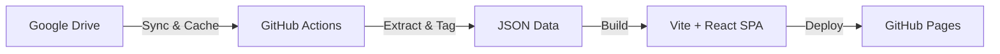

# NTWK Coffee Science — Deep Research Portal ☕️🔬

คลังความรู้และพอร์ทัลวิเคราะห์งานวิจัยวิทยาศาสตร์กาแฟเชิงลึก (**Coffee Science Deep Research**) ซิงค์ข้อมูลอัตโนมัติจาก **Google Drive** และปรับโครงสร้างพร้อมแท็กหมวดหมู่อัตโนมัติ แสดงผลบนหน้าเว็บสไตล์ Bauhaus Editorial

---

## 🌟 ฟีเจอร์หลัก (Core Features)

- **Automated Sync**: ดึงบทความจาก Google Drive อัตโนมัติทุกวันเวลา 12:00 น. (ICT) ผ่าน GitHub Actions
- **Smart Data Deduplication**: ตรวจสอบการแก้ไขด้วย Manifest Cache และป้องกันไฟล์ซ้ำซ้อน 4 ชั้น (4-Layer Anti-Duplication Engine)
- **Auto-Tagging System**: วิเคราะห์เนื้อหาและติดแท็กตามหมวดหมู่วิทยาศาสตร์กาแฟ (เช่น `#SensoryScience`, `#RoastingChemistry`) อัตโนมัติ
- **Modern Editorial UI**: หน้าเว็บแบบ Bauhaus Studio Notebook ที่สะอาดตา อ่านง่าย พร้อมรองรับ KaTeX สำหรับสมการเคมีและคณิตศาสตร์
- **Fast & Precise Search**: ค้นหาบทความ ชื่อสารเคมี ผู้แต่ง หรือแท็กแบบ Real-time

---

## 🔄 ภาพรวมระบบ (Architecture Overview)

---

## 💻 Tech Stack

- **Data Pipeline**: Python 3, Google Drive API
- **Frontend**: React 18, TypeScript, Vite, Tailwind CSS 3
- **Deployment**: GitHub Actions, GitHub Pages
