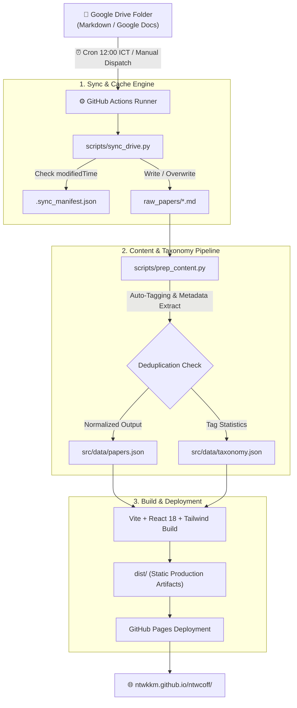

# NTWK Coffee Science — Deep Research Portal ☕️🔬

คลังความรู้และพอร์ทัลวิเคราะห์งานวิจัยวิทยาศาสตร์กาแฟเชิงลึก (**Coffee Science Deep Research**) ซิงค์ข้อมูลอัตโนมัติจาก **Google Drive** ผ่าน **GitHub Actions** ทุกวันเวลา **12:00 น. (เวลาไทย)** พร้อมระบบวิเคราะห์จัดแท็กอัตโนมัติ (Taxonomy Engine) และหน้าเว็บสไตล์ Modern Editorial พร้อมการแสดงผลสมการคณิตศาสตร์และสูตรเคมี (KaTeX)

[](https://github.com/NTWKKM/ntwcoff/actions/workflows/sync.yml)
[](https://ntwkkm.github.io/ntwcoff/)
[](LICENSE)

---

## 🌟 ฟังก์ชันการทำงานหลัก (Core Capabilities)

### 1. ระบบซิงค์คลาวด์อัตโนมัติ (Automated Drive Sync Pipeline)
- **Daily Automated Schedule**: ซิงค์ข้อมูลอัตโนมัติทุกวันเวลา **12:00 น. ICT** (Indochina Time, UTC+7 / `05:00 UTC`) ผ่าน GitHub Actions
- **On-Demand Dispatch**: รองรับการกดรันซิงค์ด้วยมือได้ทันทีผ่าน `workflow_dispatch` บนแท็บ Actions
- **Multi-Format Ingestion**: รองรับทั้งไฟล์ Markdown (`.md`), ข้อความธรรมดา (`.txt`), และเอกสาร Google Docs (แปลงเป็น Text/Markdown อัตโนมัติ)
- **Smart Manifest Cache (`.sync_manifest.json`)**: ตรวจสอบ `modifiedTime` ของไฟล์บน Google Drive หากไฟล์ไม่มีการแก้ไขจะข้ามการดาวน์โหลดทันที (`[UNCHANGED]`) ช่วยประหยัดเวลาและ Bandwidth

---

### 2. ระบบป้องกันไฟล์และข้อมูลซ้ำ 4 ชั้น (4-Layer Anti-Duplication Engine)
- **Layer 1 (File Storage)**: บันทึกทับไฟล์เดิมในพาธ `raw_papers/<file_name>.md` ทันที ไม่สร้างไฟล์เบิ้ล (เช่น `file (1).md`)
- **Layer 2 (Drive Collision Resolution)**: ตรวจจับกรณีมีหลายไฟล์ใน Google Drive ที่ตั้งชื่อซ้ำกันเป๊ะ (คนละ File ID) โดยระบบจะเติม Short ID (`_{id[:6]}`) กำกับอัตโนมัติเพื่อป้องกันไฟล์ชนกัน
- **Layer 3 (Git Versioning)**: ใช้การตรวจสอบ Content Hash หากไฟล์ที่ดึงมาเนื้อหาไม่เปลี่ยนแปลง Git จะไม่สร้าง Commit ซ้ำ และไม่ Push ข้อมูลซ้ำซ้อน
- **Layer 4 (Data Pipeline Deduplication)**: ตรวจจับหัวข้องานวิจัยซ้ำ (Normalized Title Matching) หากพบไฟล์ที่มีชื่องานวิจัยเดียวกัน ระบบจะควบรวม (Merge) และเก็บเฉพาะฉบับล่าสุดไว้เพียง 1 รายการใน `papers.json`

---

### 3. ระบบจำแนกหมวดหมู่และจัดแท็กอัตโนมัติ (Coffee Science Taxonomy Engine)
ประมวลผลเนื้อหางานวิจัยผ่าน `scripts/prep_content.py` และติดแท็กอัตโนมัติตาม Keyword Ontology ด้านวิทยาศาสตร์กาแฟกว่า 20 หมวด:
- **กลิ่นรสและประสาทสัมผัส**: `#SensoryScience`, `#CoffeeBody`, `#Astringency`, `#Q-Grader`, `#Tribology`
- **เคมีและอุณหพลศาสตร์การคั่ว**: `#RoastingChemistry`, `#MaillardReaction`, `#SucrosePyrolysis`, `#Melanoidins`, `#Acrylamide`, `#5-HMF`
- **การสกัดและฟิสิกส์การชง**: `#Extraction`, `#WaterChemistry`, `#GrindingPhysics`, `#KineticModeling`
- **การแปรรูปและชีววิทยา**: `#Fermentation`, `#SpecialtyCoffee`, `#FoodSafety`, `#FT-ICR-MS`

นอกจากนี้ ระบบยังสกัด Metadata สำคัญครบถ้วน:
- ชื่อบทความวิจัยสากล (English Research Title)
- คณะผู้วิจัย (Authors) และสถาบันวิจัย (Institutions)
- วารสารวิชาการที่ตีพิมพ์ (Peer-Reviewed Journals & DOI Links)
- คำนวณจำนวนคำ (Word Count) และประเมินเวลาอ่าน (Estimated Reading Time)

---

### 4. ประสบการณ์การอ่านบทความแบบ Modern Editorial (Web Portal)
- **Ergonomic Coffee Aesthetics**: ออกแบบโดยใช้คู่สี Deep Espresso (`#0c0a09`), Warm Amber (`#d97706`), และสีตัวอักษร Slate White (`#e2e8f0`) ช่วยลดแสงสะท้อนและอาการล้าสายตาตามมาตรฐาน WCAG AAA
- **Dark / Light Mode**: สลับธีมมืดและธีมสว่างได้ทันที พร้อมบันทึกสถานะลงใน LocalStorage
- **Live Search & Fuzzy Matching**: ช่องค้นหาอัจฉริยะ ค้นหาได้ทั้งจากชื่อเรื่อง, สารประกอบเคมี (เช่น 5-HMF, Cation, Acrylamide), ชื่อผู้วิจัย, หรือวารสาร
- **Interactive Taxonomy Filters**: เลือกดูตามกลุ่มสาขาวิจัย (Category Pills) หรือคลิกเลือกแท็ก (Tag Chips) พร้อมแสดงจำนวนบทความในแต่ละแท็ก
- **Full Research Reader Modal**: 
  - สรุปข้อมูลจำเพาะงานวิจัย (Research Specifications Box)
  - รองรับสูตรคณิตศาสตร์และสมการเคมีด้วย **KaTeX** (\$HMW > 5\text{ kDa}\$, \$C_{21}H_{21}O_7\$, \$m/z\$, ฯลฯ)
  - ตารางผลการทดลองและกล่องสรุปผลการนำไปใช้จริง (Practical Applications)
  - ปุ่ม **Copy Citation**: คัดลอกรายการอ้างอิงรูปแบบมาตรฐานได้ในคลิกเดียว
  - รองรับ Deep Linking ผ่าน URL Hash (`#paper=<slug>`)

---

## 🔄 แผนผังการทำงานของระบบ (Data Flow Architecture)



---

## 📂 โครงสร้างไดเรกทอรี (Directory Structure)

```
ntwcoff/
├── .github/
│   └── workflows/
│       └── sync.yml              # GitHub Actions Cron 12:00 ICT + Build & Deploy Pages
├── scripts/
│   ├── sync_drive.py             # ดึงไฟล์จาก Drive, ตรวจ Manifest Cache, ป้องกันชื่อซ้ำ
│   └── prep_content.py           # สกัด Metadata, จำแนก 20 แท็ก, ลบข้อมูลซ้ำ, สร้าง JSON
├── raw_papers/                   # คลังเอกสารวิจัยต้นฉบับ Markdown ที่ซิงค์มาจาก Google Drive
├── src/
│   ├── components/
│   │   ├── Navbar.tsx            # แถบเมนูด้านบน, สวิตช์ Dark Mode, สถานะ Sync
│   │   ├── HeroBanner.tsx        # ส่วนค้นหาเรียลไทม์ และสถิติคลังวิจัย
│   │   ├── FilterBar.tsx         # ตัวเลือกหมวดหมู่วิจัย และ Tag Cloud
│   │   ├── PaperCard.tsx         # การ์ดแสดงบทวิเคราะห์แบบกระชับ
│   │   ├── PaperReader.tsx       # หน้าอ่านบทความฉบับเต็ม พร้อม Citation Tool
│   │   └── KatexRenderer.tsx     # ตัวเรนเดอร์สูตรคณิตศาสตร์และสมการเคมี
│   ├── data/
│   │   ├── papers.json           # ฐานข้อมูลงานวิจัยทั้งหมดที่ประมวลผลแล้ว
│   │   └── taxonomy.json         # สถิติหมวดหมู่และแท็กทั้งหมด
│   ├── types.ts                  # โครงสร้าง Type Definitions (TypeScript)
│   ├── App.tsx                   # คอมโพเนนต์หลักและ State Management
│   └── index.css                 # สไตล์ Tailwind CSS, KaTeX, และฟอนต์ภาษาไทย
├── ARCHITECTURE.md               # Structural Diary
├── CONTEXT.md                    # Domain Ontology Diary
├── DESIGN.md                     # Architectural Decision Records (ADRs)
└── package.json
```

---

## 💻 เทคโนโลยีที่ใช้ (Tech Stack)

- **Data Sync & Ingestion**: Python 3.11+, Google Drive API v3, Google Auth
- **Frontend Framework**: React 18, TypeScript, Vite 6
- **Styling & Design System**: Tailwind CSS 3 (Coffee & Espresso Custom Palette)
- **Scientific Typography**: KaTeX (LaTeX Math & Chemical Expressions)
- **Iconography**: Lucide React
- **CI/CD & Hosting**: GitHub Actions, GitHub Pages
